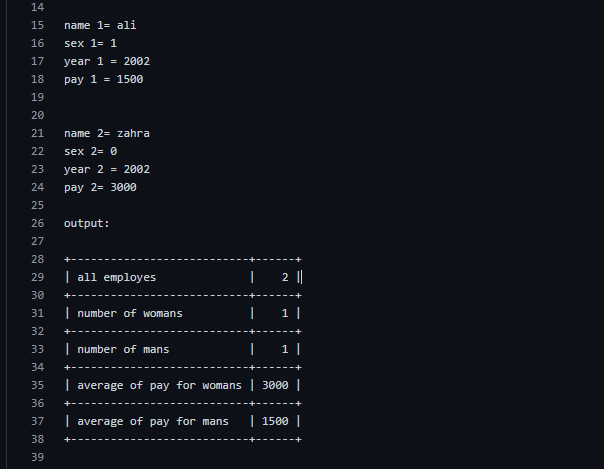

# کاردانی نرم افزار واحد پسرانه یزد

برنامه ای بنویسید که اطلاعات تعدادی کارمند از قبلی شماره کارمندی و سال استخدام کد جنسیت (0 زن | 1مرد)
پایه استخدام را دریافت کرده (1-9)
و موارد زیر را در خروجی چاپ کند

تعداد کارمندان
تعداد کارکنان زن
میانگین حقوق به تفکیک زن و مرد

مثال:

output:

