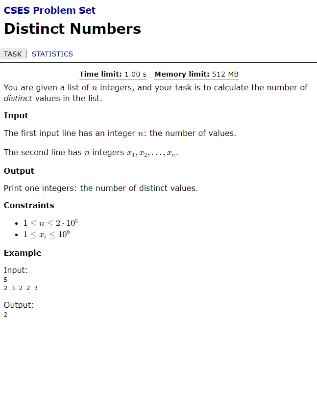

You are given a list of n integers, and your task is to calculate the number of distinct values in the list.
Input
The first input line has an integer n: the number of values.
The second line has n integers x_1,x_2,\dots,x_n.
Output
Print one integers: the number of distinct values.

https://cses.fi/problemset/task/1621

